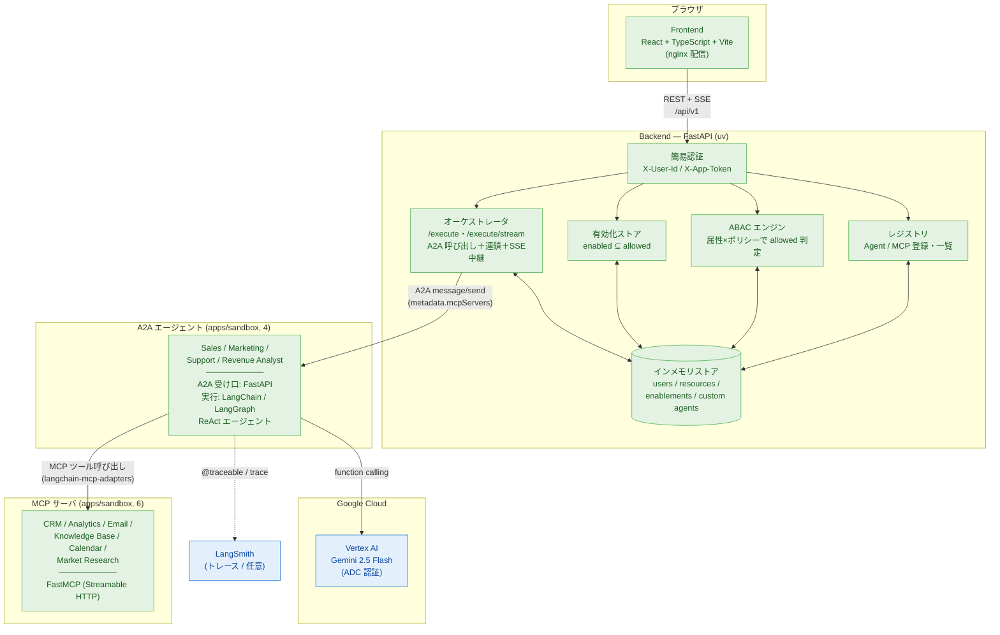
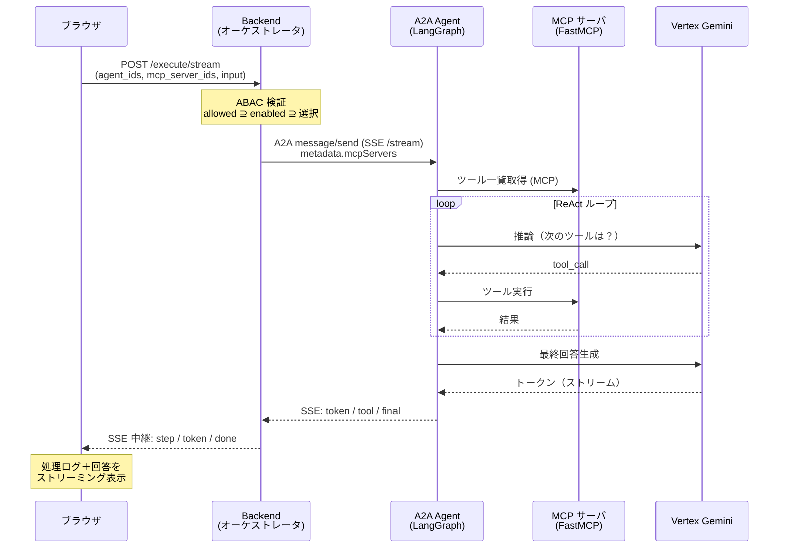
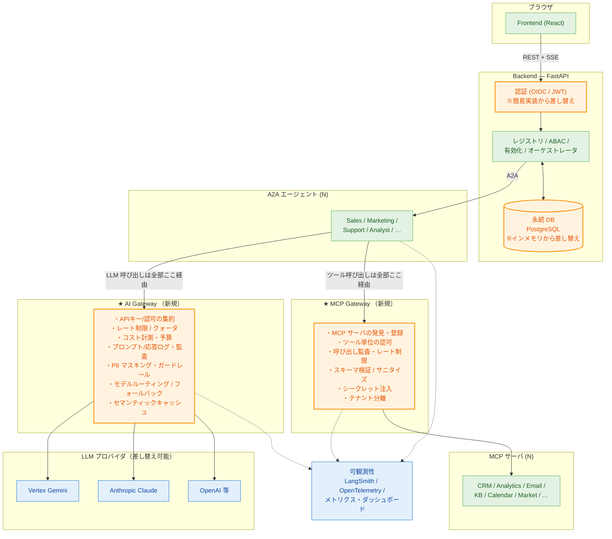
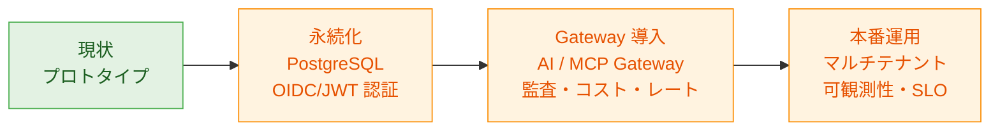

# アーキテクチャ図

このプラットフォームの構成図。 **現状（実装済み）** と、 **将来構想（AI Gateway / MCP Gateway 追加）** の 2 つを示す。
図は [Mermaid](https://mermaid.js.org/)。GitHub・VS Code（Markdown Preview Mermaid 拡張）でそのまま描画される。面接で見せるなら GitHub に push してプレビュー、もしくは [mermaid.live](https://mermaid.live) に貼ると確実。

---

## 1. 現状アーキテクチャ（実装済み）

ユーザのリクエストはフロント → backend（オーケストレータ）→ A2A で各 Agent →（Agent が）MCP に接続、という流れ。
権限は backend で 3 段階に評価し、LLM は Vertex 上の Gemini、トレースは LangSmith。

### リクエストの流れ（実行時）

---

## 2. 将来構想 — AI Gateway / MCP Gateway 追加版

**全 LLM 呼び出しを AI Gateway に、全 MCP ツール呼び出しを MCP Gateway に集約**する。
横断的な関心事（認証・レート制限・コスト管理・監査ログ・PII マスキング・キャッシュ・モデル/ツールの差し替え）を各 Agent から剥がし、**ガバナンスを 1 か所**に効かせる構成。

### なぜ Gateway を挟むのか（面接での説明用）

| 関心事 | Gateway なし（現状） | Gateway あり（構想） |
| --- | --- | --- |
| **コスト管理** | 各 Agent がバラバラに LLM を叩く。総コストが見えない | AI Gateway で全呼び出しを計測。部署別・ユーザ別に予算/上限 |
| **レート制限** | プロバイダ側の上限に各自で当たる | Gateway で集中管理、公平にスロットリング |
| **監査・コンプラ** | ログが分散 | プロンプト/応答/ツール呼び出しを一元監査。PII マスキング |
| **モデル差し替え** | 各 Agent のコード変更が必要 | Gateway のルーティング設定だけで切替・A/B・フォールバック |
| **ツールのガバナンス** | Agent が MCP に直結 | MCP Gateway がツール単位で認可・検証・シークレット注入 |
| **セキュリティ** | シークレットが各 Agent に分散 | Gateway がシークレットを集中保管・注入 |

> **言い方の例**: 「AI Gateway / MCP Gateway は、ネットワークでいう **API Gateway / サービスメッシュ**の AI 版です。横断的関心事を Agent から剥がして 1 か所に集約することで、組織が Agent やツールを増やしてもガバナンスが破綻しない。これが本番運用に向けた次の一手です。」

---

## 3. ロードマップ（現状 → 本番）

| フェーズ | 主な作業 | 解決する課題 |
| --- | --- | --- |
| 現状 | レジストリ / ABAC / GUI 実行 / A2A・MCP / ストリーミング | コア機能の実証 |
| 永続化 | インメモリ → PostgreSQL、認証を OIDC/JWT 化 | 再起動で消えない・本物の認証 |
| Gateway | AI Gateway / MCP Gateway 導入 | コスト・レート・監査・PII・モデル差し替え |
| 本番運用 | マルチテナント、OpenTelemetry、SLO/アラート | 組織スケールでの安定運用 |
